# Home-SOC-Lab
# 🛡️ Home SOC Lab – SIEM Threat Detection

---

## 🎯 Objective

The **Home SOC Lab** project was designed to build a simulated **Security Operations Center (SOC)** environment for detecting and analyzing cyber attacks using **Splunk SIEM**.  
The goal was to ingest, visualize, and correlate logs from multiple systems (Windows, Linux, and Active Directory) to identify malicious behavior patterns such as brute-force attacks and PowerShell abuse.  

This hands-on project strengthened understanding of **threat detection engineering**, **log analysis**, and **incident response workflows**.

---

## 🧠 Skills Learned

- Practical implementation of a **SIEM environment** (Splunk)  
- Analysis and correlation of logs from Windows, Linux, and Sysmon  
- Creation of **Splunk SPL detection rules** and dashboards  
- Understanding **MITRE ATT&CK** tactics for common adversarial behaviors  
- Configuring log forwarders (Winlogbeat, Syslog, and Splunk Universal Forwarder)  
- Network configuration and isolation using **VirtualBox NAT/Host-only** networks  
- Development of documentation and incident reports  

---

## 🧰 Tools Used

- **Splunk**  
- **Windows Server 2025 (Active Directory)** 
- **Windows 11 Client**  
- **Ubuntu Server**  
- **Sysmon & Winlogbeat**  
- **VirtualBox**
- **PowerShell & Hydra**  
---

## 🏗️ Steps:

### 🖥️ Step 1 – Lab Architecture

The following diagram provides an overview of the SOC lab environment.
It includes a Splunk Server, Active Directory Domain Controller, Windows 11 endpoint, Ubuntu Server, and Kali attacker machine, all connected on the same virtual network (192.168.10.0/24).
Each host contributes logs to Splunk through Sysmon and Splunk Universal Forwarder, while Atomic Red Team and Kali are used to generate realistic attack telemetry.

📸  
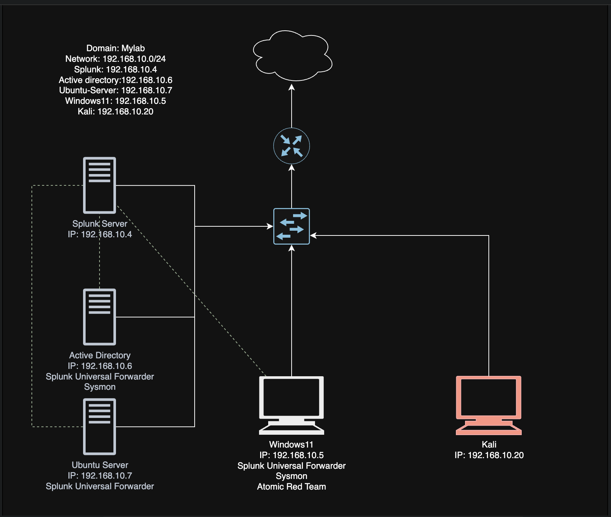
*Network topology of the lab (Splunk, AD, Windows client, Ubuntu attacker).*

---

### ⚙️ Step 2 – Splunk Setup & Log Ingestion

**Ref 2: Splunk Configuration**

📸  
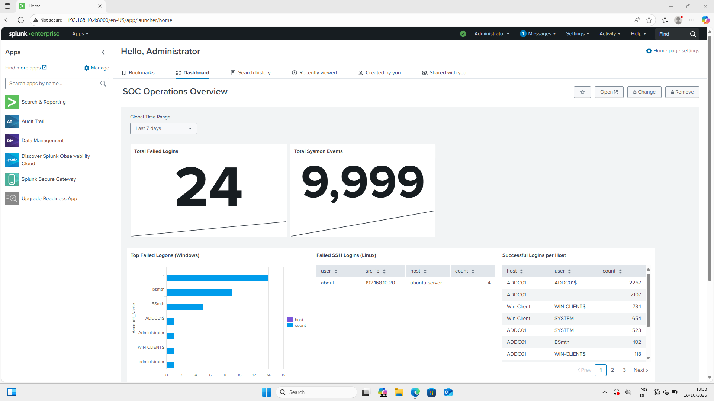
*Splunk Enterprise web UI — main dashboard.*

Splunk Enterprise successfully installed and running on 192.168.10.10:8000, and collects logs from Sysmon, Winlogbeat, and the Universal Forwarder.


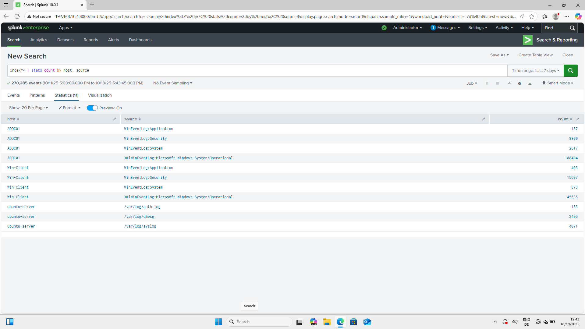
*Configured Splunk inputs to receive event logs*

Windows Sysmon, Winlogbeat, and Linux Syslog sources via Universal Forwarder on port 9997.
Validation of log ingestion from all endpoints. Splunk indexes confirm receipt of data from Windows 11, Ubuntu Server, and Active Directory hosts

---

### 💥 Step 4 – Simulating Attacks

An SSH/RDP brute-force and Atomic Red Team attack was launched against the Windows Server and Ubuntu Server to generate realistic log data.

**Ref 4.1: Brute Force RDP Simulation**

📸  
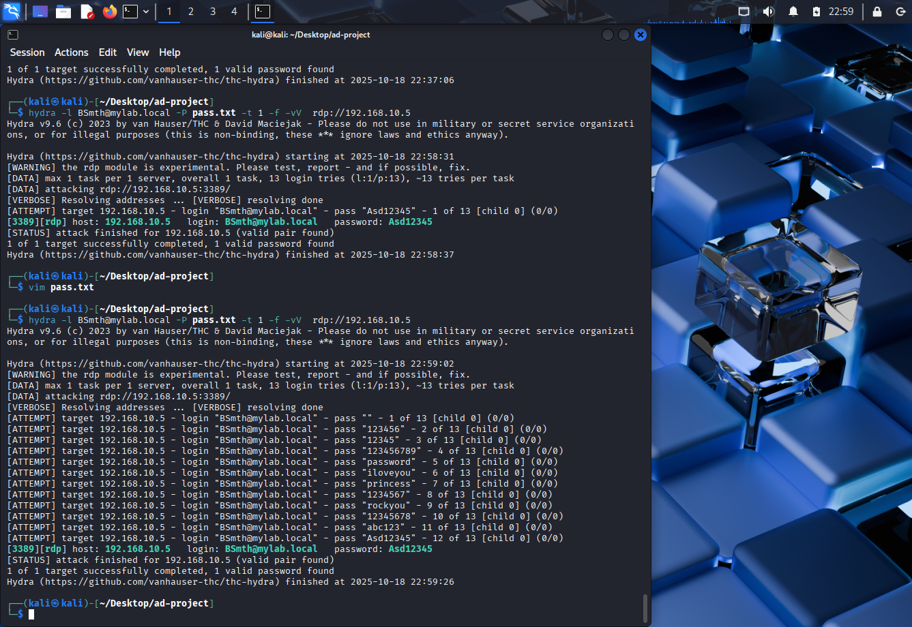
*Brute Force Attack aginst Windows11 (RDP) using Hydra*


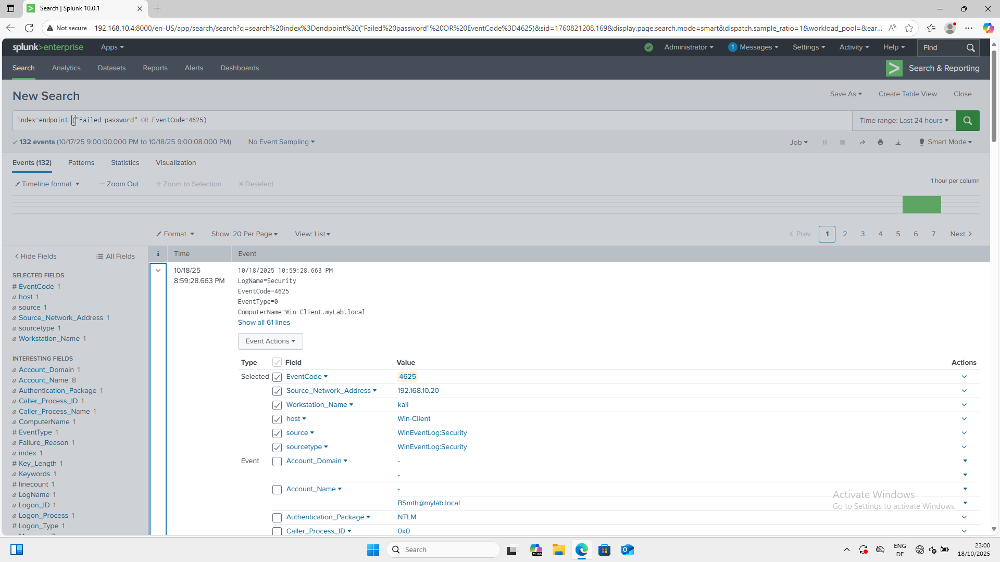
*The attack produced multiple failed authentication events (Event ID 4625).*


**Ref 4.2: Brute Force SSh Simulation**


📸  
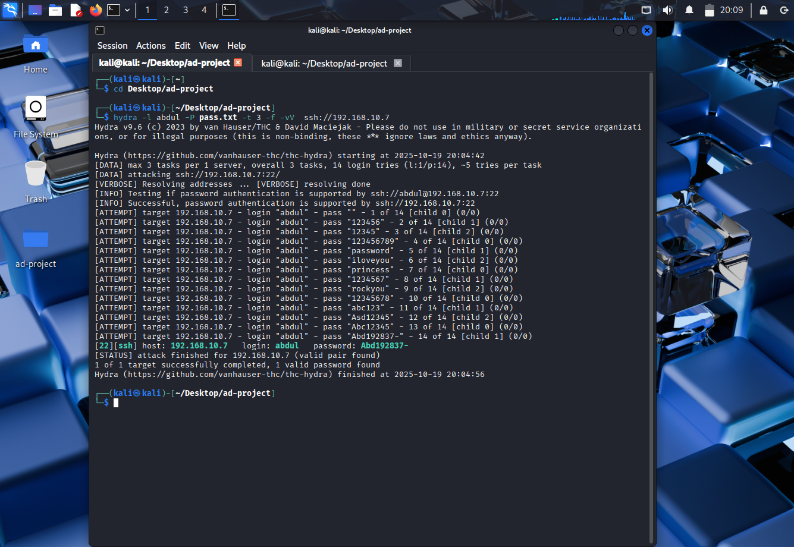
*Brute Force Attack aginst Ubuntu server (SSh) using Hydra*


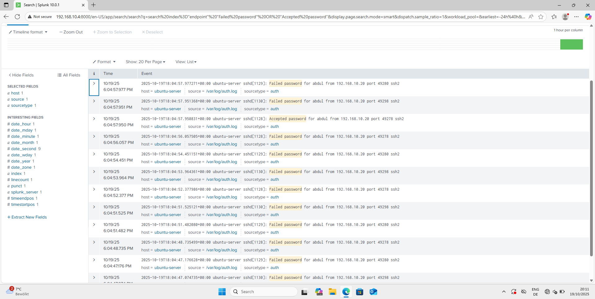
*The attack produced multiple failed password events.*


**Ref 4.2: Atomic Red Team — T1136.001 (Create Account)

A short, controlled Atomic Red Team exercise (technique **T1136.001 — Create Account: Local Account**) was executed. The test used a PowerShell command to create a local account and exercise related activity; the resulting events were ingested into Splunk for verification and tuning.


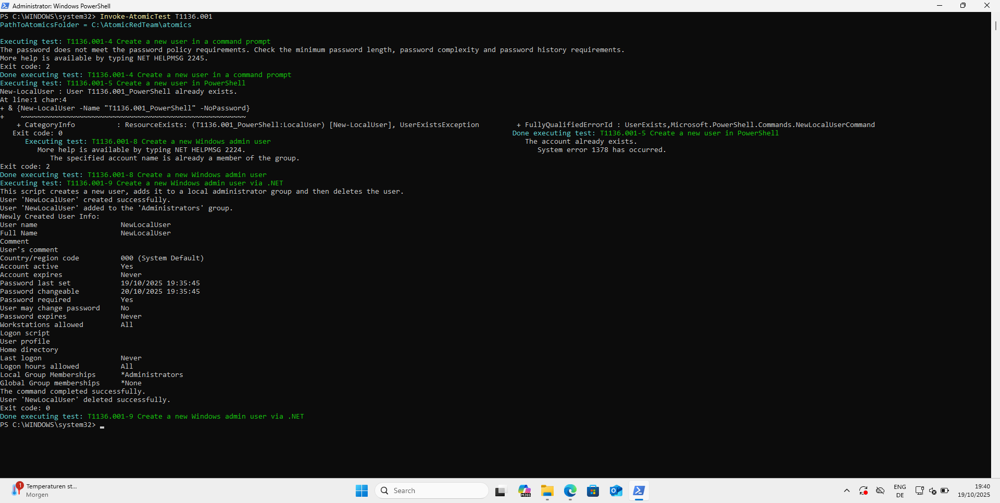
*PowerShell command used to execute the Atomic Red Team test (T1136.001).*

**Detected Event Codes:**  
- **4720** — A user account was created  
- **4722** — A user account was enabled  
- **4724** — An attempt was made to reset an account password  
- **4726** — A user account was deleted

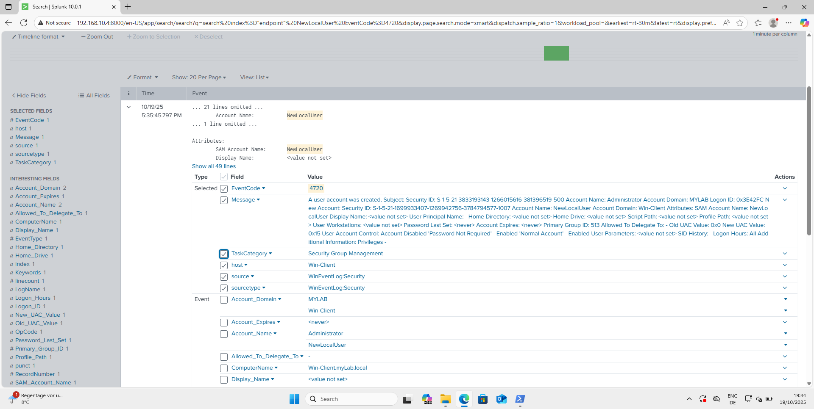

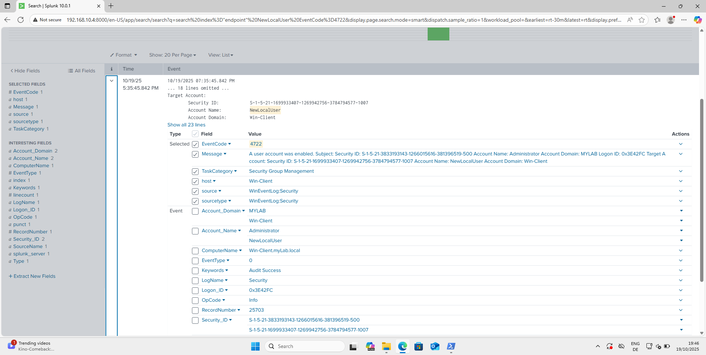

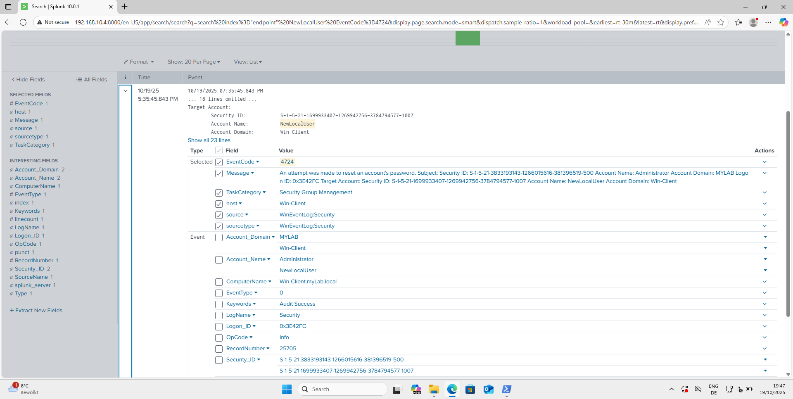

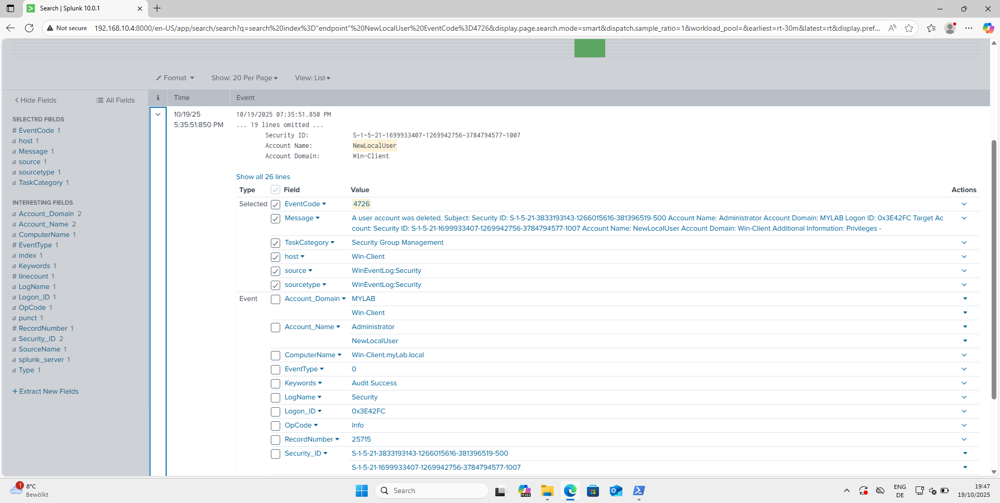
*Windows Security Event Logs generated during the simulation.*

The test confirmed that account creation and modification activities are properly logged and detectable within the Windows Event Log system and SIEM.

---

### 🚨 Step 5 – Detection Rules & Alerts

**Ref 5: SPL Detection Query**

A Splunk SPL rule was created to detect multiple failed login attempts within a short timeframe, triggering a brute-force alert.

```spl
index=security sourcetype=WinEventLog:Security EventCode=4625
| stats count by Account_Name, IpAddress
| where count > 5
